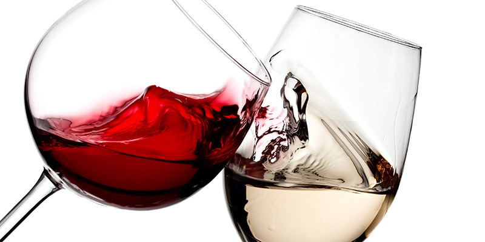

# Red or White?

It's one of the most famous either/or questions, a restless debate and one that garners fierce loyalists on both teams. A simple question, yet has a multitude of varying responses as to why someone would prefer a glass of red versus white. There may be a never-ending set of answers as to why one prefers one type over the other. However, today we set aside our differences to focus on solving and understanding a greater complexity when it comes one the alcoholic beverage-its healthiness. While we rely on one of our five senses, taste, to largely determine our liking for wine, we look to explore on a more granular level the chemical makeup of wine and which one essentially is deemed the healthier option for people. 

Winemaking is a multi-billion dollar industry, an assembly process that leads to the creation an alchoholic beverage that is a global commodity product. With each wine brand and wine type, its process and ingredients are distinct. We will investigate a number of physicochemical variables to determine how largely red and white wine differ. Ultimately, through our data exploration and analysis, we seek to determine which wine is the healthier option for consumption. For our study, we will be utlizing data focusing on the Portuguese "Vinho Verde" wine, one of the most famous wine varities of Portugal, to determine if we are able to arrive at a conclusion. 

## Collaborators
| Names | Role | Description |
| :---         |     :---:      | :---         |
| Vannesa Martinez | Project Manager | Managing the project presentation and visualization|
| Aggie Jasinski | Data Gathering | Gather the dataset csv's and preprocessing the datasets|
| Roman Dobczansky | Machine Learning | Creation of the Machine Learning Model |
| Rasna| GitHub Repository and Databse | Responsbile for the repository and the Database section |

## Data Sources
Datasets were obtain via Kaggle
- Red wine: wineequality-red.csv
- White wine: winequality-white.csv

## Data Description
In our analysis we utilize two datasets that of the red and white Portuguese "Vinho Verde" wine brand to determine if the chemical components levels correlate with our hypothesis of the healthier wine. In both datasets, each focus on the same variables, which are part of our merged dataset. The variables that will be part of our examination are as followed:
- fixed acidity
- volatile acidity
- citric acid
- residual sugar
- chlorides
- free sulfur dioxide
- total sulfur dioxide
- density
- pH
- sulphates
- alcohol

## Investigation Questions
- Are there vast chemical compound differences between the red and white wine datasets being compared?
- Which type of wine presents less alcohol, acidity, and sulphate?
- Which wine is a healthier option for consumers?
