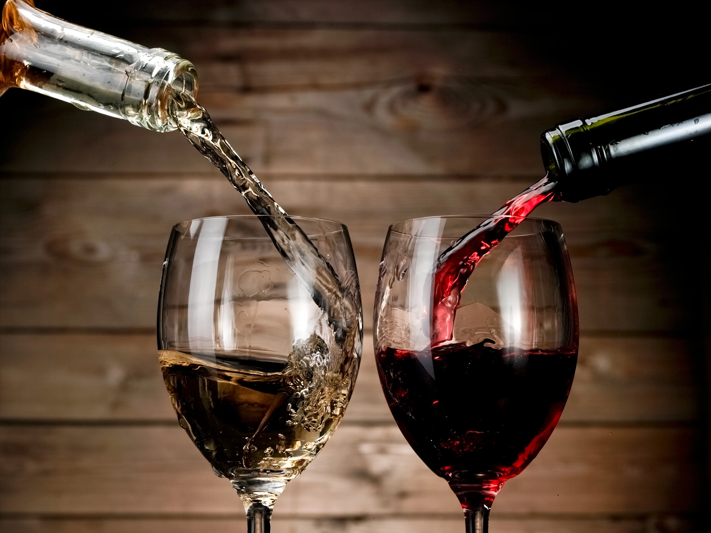
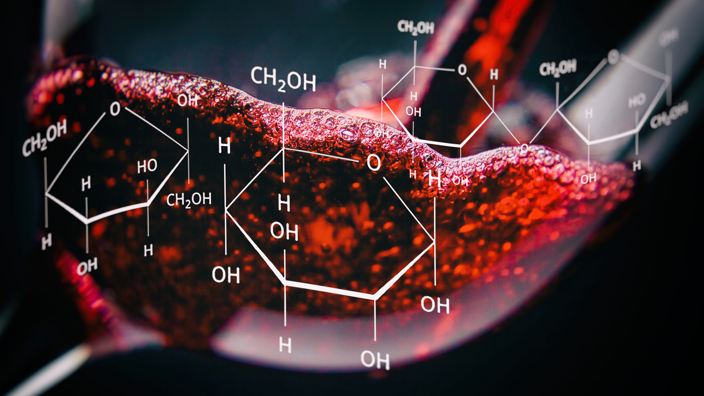
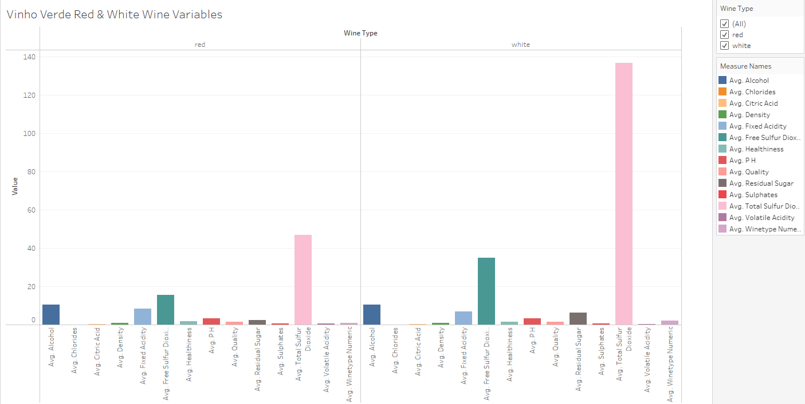
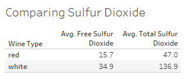
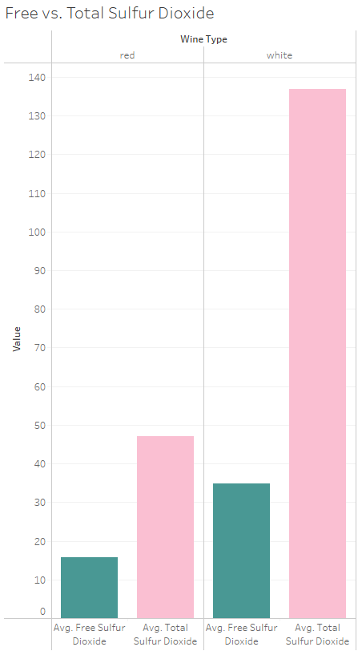
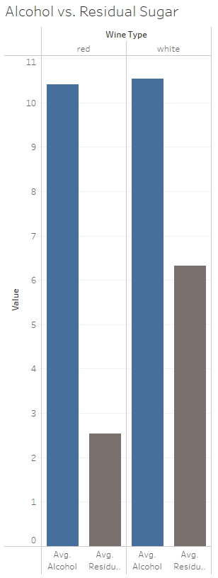
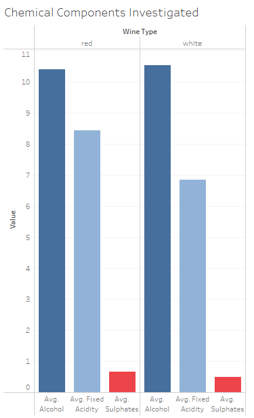
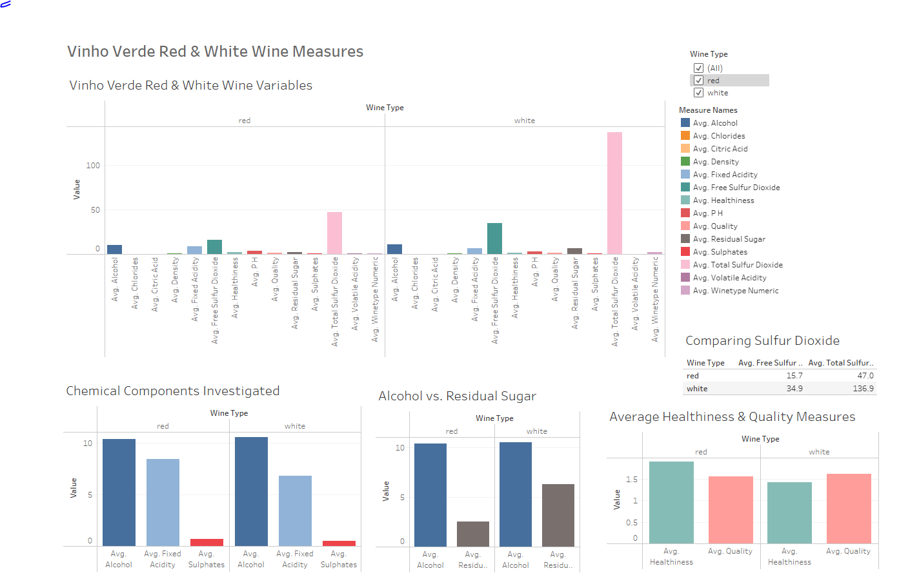
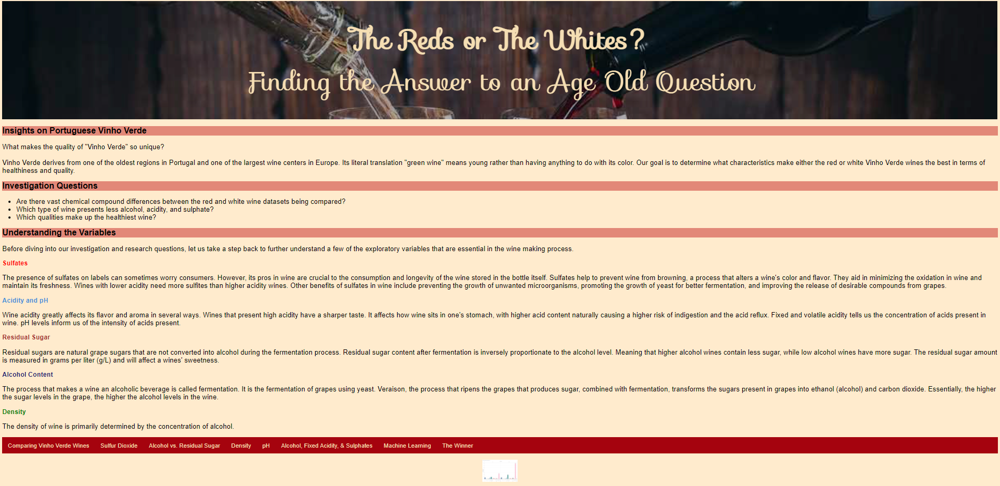
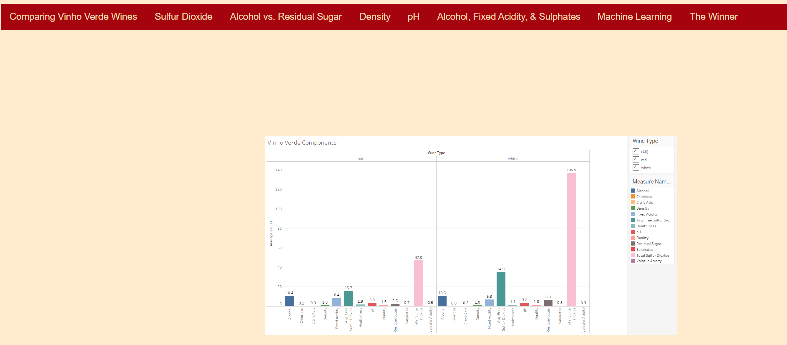

# Red or White?

## Introduction
It is one of the most famous either/or questions, a restless debate and one that garners fierce loyalists on both teams. A simple question, yet has a multitude of varying responses as to why someone would prefer a glass of red versus white. There may be a never-ending set of answers as to why one prefers one type over the other. However, today we set aside our differences to focus on solving and understanding a greater complexity when it comes to wine-its healthiness. While we rely on one of our five senses, taste, to largely determine our liking for wine, we look to explore on a more granular level the chemical makeup of wine and which one essentially is deemed the healthier option. 

Winemaking is a multi-billion dollar industry, an assembly process that leads to the creation of an alcoholic beverage that is a global commodity product. With each wine brand and wine type, its process and ingredients are distinct. We will investigate a number of physicochemical variables to determine how largely red and white wine differ. For our study, we will be utilizing data focusing on the Portuguese "Vinho Verde" wine, one of the most famous wine varieties of Portugal. Through our data exploration and analysis, we seek to determine which wine is the healthier option for consumption.

## Insight on Portuguese Vinho Verde
What makes the quality of **“Vinho Verde”** so unique?

Known as the second-highest selling wine in Portugal, “Vino Verde” derives from one of the oldest regions in Portugal and one of the largest wine centers in Europe. Its literal translation “green wine”) is not a grape type. **“Green” means young** rather than anything to do with its color. A single glass of wine contains thousands of different chemical compounds which determine its quality. We are to find out what characteristics make a Vinho Verde a Vinho Verde. Is it the region of Vinho Verde or the unique chemical compounds that make up this young wine's quality and taste?

## Collaborators
| Name | Role | Description |
| :---         |     :---:      | :---         |
| Vannesa Martinez | Project Manager | Managing the project presentation and visualization|
| Aggie Jasinski | Data Gathering | Gathering the dataset csv's and preprocessing the datasets |
| Roman Dobczansky | Machine Learning | Creating the framework of the Machine Learning Model |
| Rasna Sethi | GitHub Repository and Database | Organizing and maintaining the repository and the database creation |

## Technologies, Languages, Tools, and Algorithms Used
- Jupyter Notebook
- Python
- Pandas
- NumPy
- PostgresSQL
- sklearn
- Tableau
- JavaScript
- CSS
- HTML
- Machine Learning Model Choice: TensorFlow

## Data Sources
Datasets were obtained through Kaggle
- Red wine: [wineequality-red.csv](https://www.kaggle.com/code/vishalyo990/prediction-of-quality-of-wine/notebook)
- White wine: [winequality-white.csv](https://www.kaggle.com/datasets/piyushagni5/white-wine-quality?select=winequality-white.csv)

## Data Description
In our analysis, we utilize two datasets of the red and white Portuguese "Vinho Verde" wine brand to determine if the chemical components levels correlate with our hypothesis that red wine is healthier and greater quality than white wine. Both datasets focus on the same variables types. The variables that will be part of our examination are as followed:
- fixed acidity
- volatile acidity
- citric acid
- residual sugar
- chlorides
- free sulfur dioxide
- total sulfur dioxide
- density
- pH
- sulfites
- alcohol

## Investigation Questions
- Are there vast chemical compound differences between the red and white wine datasets being compared?
- Which type of wine presents less alcohol, residual sugar, acidity, and sulphate?
- Which qualities make up the healthiest wine?

## Understanding the Variables

Before diving into our investigation and research questions, let us take a step back to further understand a few of the exploratory variables that are essential in the wine making process.

### Sulfates
The presence of sulfates on labels can sometimes worry consumers. However, its pros in wine are crucial to the consumption and longevity of the wine stored in the bottle itself. Sulfates help to prevent wine from browning, a process that alters a wine's color and flavor. They aid in minimizing the oxidation in wine and maintain its freshness. Wines with lower acidity need more sulfites than higher acidity wines. Other benefits of sulfates in wine include preventing the growth of unwanted microorganisms, promoting the growth of yeast for better fermentation, and improving the release of desirable compounds from grapes. 

From a health standpoint, there are a few risks associated with sulfate consumption that individuals can develop. Some side effects include:
-	Headache
-	Rash
-	Hives
-	Swelling of the month and lips
-	Trouble breathing
-	Anaphylaxis

### Acidity and pH
Wine acidity greatly affects its flavor and aroma in several ways. Wines that present high acidity have a sharper taste. It affects how wine sits in one's stomach, with higher acid content naturally causing a higher risk of indigestion and the acid reflux. Fixed and volatile acidity tells us the concentration of acids present in wine. pH levels inform us of the intensity of acids present. 

### Residual sugar
Residual sugars are natural grape sugars that are not converted into alcohol during the fermentation process. Residual sugar content after fermentation is inversely proportionate to the alcohol level. Meaning that higher alcohol wines contain less sugar, while low alcohol wines have more sugar. The residual sugar amount is measured in grams per liter (g/L) and will affect a wine’s sweetness. 

### Alcohol content
This is the percentage of alcohol content of the wine which can range anywhere from 5% and 23%. The process that makes a wine an alcoholic beverage is called fermentation. It is the fermentation of grapes using yeast. Veraison, the process that ripens the grapes that produces sugar, combined with fermentation, transforms the sugars present in grapes into ethanol (alcohol) and carbon dioxide. Essentially, the higher the sugar levels in the grape, the higher the alcohol levels in the wine. ABV which stands for “alcohol by volume” is the alcohol percentage measurement in a beverage. 

### Density
The density of wine is primarily determined by the concentration of alcohol.

## Data Exploration and Analysis

Upon initial review, we wanted to see which chemical components of the red and white wine differed from one another. 

Our primary analysis shows that white wine has a significant amount of sulfur dioxide as compared to red white. 

Furthermore, white wine also has more residual sugars than red wine. We think this may impact alcohol content because the residual sugar is what is leftover after the wine becomes an alcoholic beverage. We found that the average alcohol content of both red and white wine were similar, leaving us to believe that either different, perhaps sweeter, grapes are used for the white wine making process or that white wine ages differently. 

With research in hand, we decided that the factors that most impact "healthiness" and "quality" were sulfates, fixed acidity, and alcohol content.

## Database
We create a master database of red and white wine qualities by codifying red and white wines separately. This makes it easier to compare and contrast the qualities of red and white wines. We initiate our process by establishing an ERD that demonstrates the schema between the red and white wine datasets.

We utilize PostgresSQL to create relational databases that establish what qualities contribute to "healthiness" and "quality." There are separate databases for red and white wine and each one displays the qualities of "healthiness" and "quality."

## Machine Learning Module
Through the use of the Machine Learning tools in sklearn and TensorFlow, we aim to predict Vinho Verde’s healthiness and quality based on chemical compositions of red and white wine. We decided to use the Tensorflow model for the following reasons:
 
  - It's an opensource platform, which means that is available to all the users around on a variety of systems.
  - It's scalable, which means almost every operation can be performed using this platform.
  - It is compatiable with many languages including Python and JavaScript. This allows any user to work in whatever environment they are comfortable in.
  - It makes it possible to build models for machine learning and deep learning.
  - It allows training models directly in the browser.
  - It attempts to solve a problem with infinite attempts until the most accurate solution is reached.

Some of the disadvantages include:
  - It has a slow speed. 
  - It does not offer many features for the Windows operating system. Windows users can still download TenserFlow via the anaconda prompt or pip install but they are still limited by it's usability.
  - It is inconsistent in that it contains homonyms as names of its content which makes it difficult for a user to remember and use.
  
Healthiness is determined by sulfate levels while quality via acidity and alcohol content. The plan for our machine learning model uses TensorFlow to implement input variables from red and white wine data. This model is conducted as a supervised Machine Learning model because we want to accept or reject the hypothesis that red wine is healthier and tastier because of higher levels of "quality" and "healthiness". 

The output determines which wines are highest in quality using the neural network nodes as metrics of fixed acidity and alcohol content. First, we import our dependencies. Then, we process the data by dropping unnecessary variables to determine the number of unique data points. Next, we bin the "winetype" by numeric values (1=red,2=white) and generate our categorical variable lists. Importantly, we define "healthiness" by creating a column with metric scored based on sulfate content that is binary (1=healthy, 2=not healhty). "Quality" is also defined by a binary scale (1=low quality, 2=high quality). StandardScaler is created to fit and scale the data for compiling, training, and evaluating the model. The model consists of a deep learning neural network that is sequentialy composed of a first hidden layer, a second hidden layer and an output layer. Lastly, the structure of the model is checked for a summary: 

Our dependent variables, "healthiness" and "quality," are tested against both red and white wine. Seventy-five percent of the data is trained and and twenty-five percent of the data is tested. The model is compiled and trained into 100 epochs (the accuracy percentage is 80.63% and does not get any higher after 69 iterations.) Finally, the model is evaluated using the test data for loss (-4.1752) and accuracy (0.8054).

A new set of checkpoint dependencies are imported (os, tensorflow.keras.callbacks and ModelCheckpoint). We define the checkpoint path and filenames by creating a callback that saves the model's weights every 5 epochs.

## Results
- Are there vast chemical compound differences between the red and white wine datasets being compared?
  - We notice from our initial investigation of the data and our data visualizations that there is significantly more sulfur dioxide in white wine than red wine. Additionally, white wine has more residual sugar but less alcohol content overall. This result is interesting since we thought the sugar remaining after the wine becomes alcohol would mean that there would be a higher alcohol content. As discussed earlier, we think this may be either because different grapes are used for red vs. white wine and/or the aging process for white wine might differ from red wine.
  
- Which type of wine presents less alcohol, residual sugar, acidity, and sulphate?
   - According to our results, both white and red wine have about the same average alcohol level. White wine has more residual sugar than red wine, red wine is more acidic than white wine, and white wine has less sulphates than red wine.
    
   
   
   
   
   
   
   

- Which qualities make up the healthiest wine?
  - We conclude that red wine is less healthy than white wine by our measure. To measure healthiness, we use the level of sulphates a wine has.

## Dashboard
### Tools to be used:
- Tableau
- JavaScrpt
- CSS
- HTML

**Tableau Dashboard**

Now it is time to put the story altogether! There are two visualization methods we will be using to display our results from the analysis. First, we will be using Tableau to create graphs that will compare the measures of the variables within the dataset between the wines. Through using Tableau, the graphs will aid in providing a better understanding of how the variables stack against one another, what we essentially first sought to understand in our data exploration phase. Further more, the graphs have all been constructed with the user have an ability to filter not only between wines, but also all variables within the dataset.

**Web Page**

[html_site](https://sethi-rasna.github.io/Wine_Os/)

Every bottle of wine has its own story, and through putting together an HTML web page, we hope that visitors of the site will grasp and follow Vinho Verde's data analytics story. There are a few interactive elements for visitors. Buttons that will allow users to toggle between different tabs. Each tab will contain an image depicting information comparing contents found in both red and white wine. 

When a user hovers over the image, a transition feature is also added to give it an additional interactive element that allows the picture to expand in size and review the images in greater detail.  

### Tableau Story
[Study on Portguese Vinho Verde Wines](https://public.tableau.com/app/profile/vannesa.martinez/viz/PortgueseVinhoVerdeRedvs_WhiteWines/Dashboard1?publish=yes)

## Google Slide
[Presentation Link](https://docs.google.com/presentation/d/1FuBTL0TB9id7cwCmETkrJSE-uFu8w-liyU0KQio8Rgo/edit?usp=sharing)

